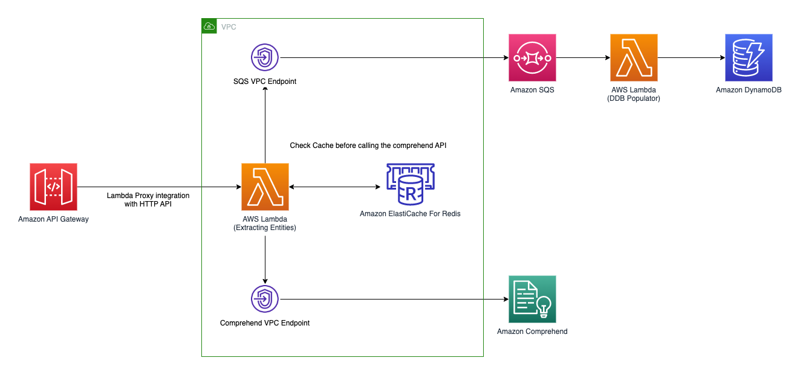

# aws-serverless-comprehend-app
A serverless application built with AWS SAM, focused around using AWS Comprehend to perform NLP on given text.

The general gist of this application is to provide the following functionality:
- Use API gateway to expose the entity extractor function
- The entity extractor function:
  - performs named entity recognition on the text submitted via API gateway using AWS Comprehend interface endpoint
  - makes use of ElastiCache in order to reduce the compute required when requests are the same
  - pushes the hashed text and extracted entities onto a queue for consumption by another service
- The DynamoDB populator function:
  - triggered by new queue items, batching 10 at a time
  - stores the queue message contents in DynamoDB

# Testing

